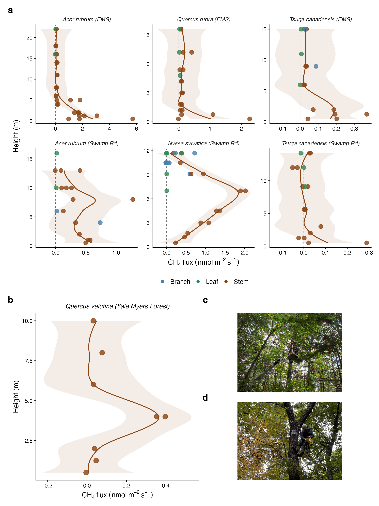
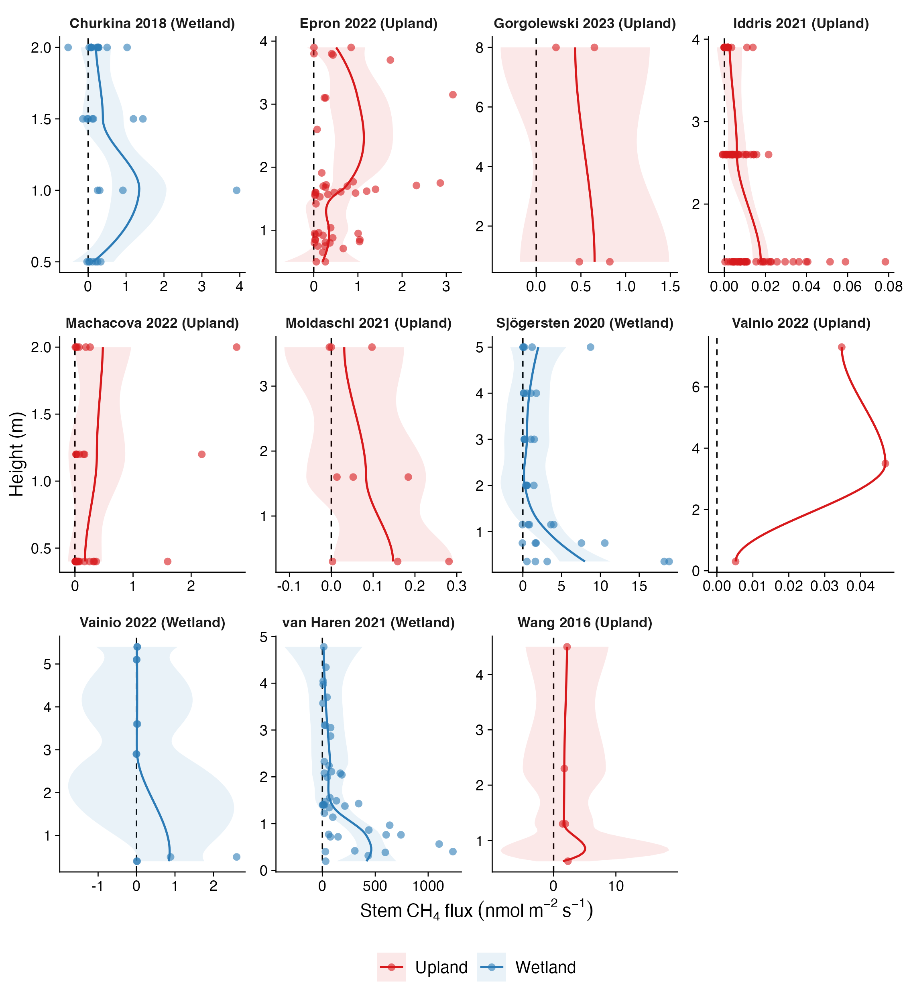
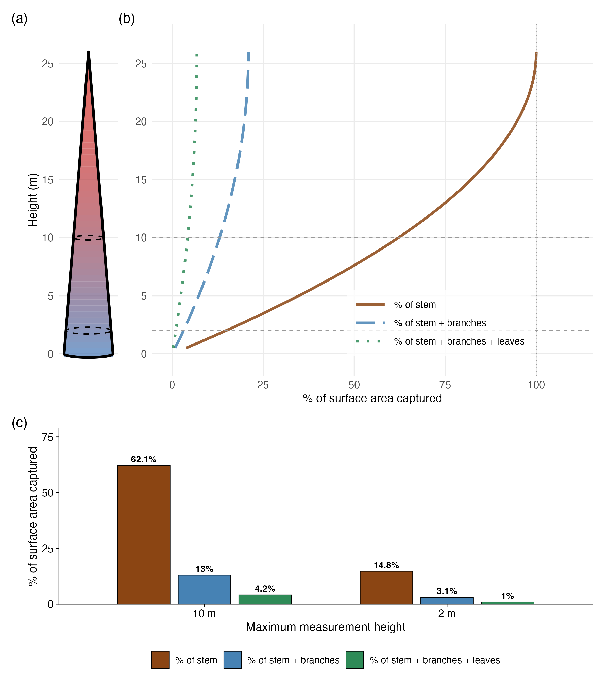

# Ground-to-Canopy Tree Methane Fluxes: Implications for Scaling and Forest Budgets

**Jonathan Gewirtzman, Luke Jeffrey, Hannah Burrows, Damien Maher, Mark A. Bradford, Peter A. Raymond, Jaclyn Hatala Matthes**

Yale School of the Environment, New Haven, CT, USA

Corresponding author: jonathan.gewirtzman@yale.edu

Target journal: Geophysical Research Letters ([Special Issue: 250 Years of Methane Science](https://agupubs.onlinelibrary.wiley.com/hub/journal/19449224/homepage/call-for-papers/si-2026-000065))

Alt Titles:
1. Ground-to-Canopy Measurements Are Needed to Resolve Trees' Role in Methane Budgets
2. More Evidence Is Needed for Widespread Methane Uptake by Tree Surfaces
3. Tree Methane Flux Direction and Magnitude Estimates Are Highly Sensitive to Scaling Assumptions

---

## Key Points

1. Most stem CH₄ studies do not measure above 2 m, sampling ~1% or less of total tree surface area.
2. Above 2 m, uptake is infrequent (6–7% of observations) and emission hotspots are sometimes observed, suggesting flux magnitude is not always a simple function of height.
3. Expanded vertically resolved measurements across species and ecosystems are needed to support conclusions about the role of trees in methane budgets.

---

## Abstract

The role of trees in methane (CH₄) budgets remains uncertain, with estimates ranging from substantial sources to substantial sinks at regional to global scales. Some studies have suggested that flux direction may reverse with height, with implications for forest and global CH₄ budgets. We combined ground-to-canopy flux measurements from seven temperate trees measured to 22 m with a reanalysis of published observations to evaluate evidence for height-dependent changes in flux direction. In our field data (141 measurements), mean flux declined 3.4-fold above 2 m but remained predominantly positive, with discrete emission hotspots at height and only a small fraction of above-2 m observations negative. Reanalysis of a recent synthesis spanning 50 studies showed that only 20% included measurements at or above 2 m, and negative fluxes at these heights were infrequent. Together, these results indicate that vertically resolved measurements remain sparse and that canopy-scale flux direction likely varies across species, ecosystems, and conditions. Because most tree surface area resides above commonly sampled heights, whole-tree methane budgets are sensitive to assumptions about vertical flux structure and canopy exchange. Expanded ground-to-canopy observations would better constrain the magnitude and variability of canopy contributions to forest methane budgets.

## 1. Introduction

Trees transport methane (CH₄) from the subsurface to the atmosphere. Over the past two decades, studies have documented CH₄ emissions from tree stems across ecosystems ranging from tropical wetlands to temperate upland forests (Pangala et al., 2017; Covey et al., 2012; Barba et al., 2019; Gauci, 2025). In wetlands, these emissions are thought to originate primarily from methanogenesis in anoxic soil microsites, with CH₄ transported upward through the xylem or bark tissues and released through the stem surface (Covey & Megonigal, 2019), though internal methanogenesis within heartwood can also contribute in wetlands and uplands alike (Wang et al., 2016; Gewirtzman et al., 2025).

A consistent observation across this literature is that stem CH₄ fluxes decline with measurement height. Fluxes measured near the base of the tree (typically below 1–2 m) tend to be substantially larger than those measured higher on the stem, particularly in wetlands. This pattern is generally attributed to the proximity of lower stem surfaces to the soil CH₄ source and to the potential for diffusive loss and oxidation during upward transport, though internal methanogenesis within wood tissues can also produce localized emissions at height (Mochidome et al., 2025).

Recently, several authors have extended this declining-flux pattern to suggest that tree surfaces may switch from net emission to net uptake at canopy heights (Gauci et al., 2024, 2025). Gauci et al. (2024) reported net CH₄ uptake on woody surfaces above approximately 2 m in tropical, temperate, and boreal forests and estimated a global woody-surface CH₄ sink of 24.6–49.9 Tg yr⁻¹. Jeffrey et al. (2021a) demonstrated that methane-oxidizing bacteria residing in tree bark can reduce net stem CH₄ emissions, with some conditions leading to net methane uptake (Leung et al., 2026). Other studies have reported net CH₄ oxidation by stems or foliage under certain conditions (Machacova et al., 2021; Gorgolewski et al., 2023a). If higher-stem or canopy net uptake is widespread, it would affect how tree CH₄ fluxes are scaled to landscape and global levels, since a tree that emits at the base but absorbs CH₄ across its canopy surface area would have a substantially different net flux than one estimated from basal measurements alone. However, most tree surface area (stems, branches, and leaves) resides above the heights at which measurements are typically made (Gewirtzman, 2026).

Here we evaluate the evidence for a source-sink transition with height. We show that the empirical basis for canopy-height CH₄ uptake is limited, and that the measurements which do exist mostly do not yet support it, though more notably, measurements are lacking in the spatial locales (ecosystems, vertical extents, tree tissues) that might most likely host such a process.

## 2. Methods

### 2.1 Field measurements

We measured CH₄ fluxes on tree stems, branches, and leaves at two sites: Harvard Forest (Petersham, MA; 42.53°N, 72.19°W) and Yale Myers Forest (Union, CT). At Harvard Forest, six trees of four species (*Acer rubrum*, *Nyssa sylvatica*, *Quercus rubra*, and *Tsuga canadensis*) were measured on 18–19 July and 16–17 August 2023. Heights ranged from ground level to 22 m. The upper canopy was accessed using a canopy aerial lift (DinoLift). At Yale Myers Forest, a single mature *Quercus velutina* was measured on 4 October 2022 at seven heights along the stem (0.5, 1.25, 2, 4, 6, 8, and 10 m), with heights above 2 m accessed via arborist climbing equipment.

### 2.2 Chamber design and gas analysis

Stem CH₄ fluxes were measured using rigid static chambers constructed from transparent plastic containers (Rubbermaid) with arcs cut to conform to the stem surface. Chamber volumes (0.5–2.0 L) were determined by gas standard dilution in the laboratory (Jeffrey et al., 2021b; Siegenthaler et al., 2016). Enclosed stem surface area was calculated as the product of the chamber's planar area and arc length. Chambers were sealed to stems using potting clay (Amaco) and secured with lashing straps. Seal integrity was verified by visual inspection, by blowing on the chamber perimeter and monitoring for CO₂ spikes, and by checking concentration linearity during measurement.

Chambers were connected via 5 mm internal-diameter PVC tubing (Bev-a-Line) to a portable off-axis integrated cavity output spectroscopy (OA-ICOS) analyzer (GLA131-GGA, Los Gatos Research) measuring CO₂, CH₄, and H₂O concentrations at 1 Hz with CH₄ precision <0.9 ppb. The analyzer's 5 L min⁻¹ flow rate provided complete chamber volume turnover within approximately 30 s. Measurements lasted 3–10 min per location, with the initial 30 s excluded to allow equilibration.

### 2.3 Flux calculation

CH₄ and CO₂ fluxes were calculated using the goFlux R package (Rheault et al., 2024), which fits linear and non-linear (Hutchinson-Mosier) models to chamber headspace concentration time series with automatic water vapor correction (Hutchinson & Mosier, 1981; Hüppi et al., 2018). Air temperature and barometric pressure were obtained from the Fisher Meteorological Station at Harvard Forest (Boose & VanScoy, 2026) and matched to each measurement by timestamp. Best-fit model selection used goFlux quality criteria including goodness-of-fit metrics, physical constraints (g-factor < 2.0; κ/κ_max ≤ 1.0), and statistical thresholds (P < 0.05; flux > minimal detectable flux). CO₂ flux R² served as a chamber seal quality metric.

### 2.4 Wu et al. (2024) reanalysis

We reanalyzed the compiled dataset from Wu et al. (2024), accessed from the supplementary material of the original publication (https://doi.org/10.1016/j.agrformet.2024.109976). The dataset contains observations from 50 studies across upland and wetland ecosystems. We used the "upland-stem" and "wetland-stem" sheets, which together contain 1,010 observations with associated measurement heights and CH₄ flux values.

Measurement heights reported as ranges (e.g., "2–4") were converted to their midpoint. Observations with missing height or flux values were excluded. We classified each study by its maximum reported measurement height and tallied observations at or above height thresholds of 2, 5, and 10 m. All reanalysis code is available in the project repository.

### 2.5 Software

All analyses were conducted in R. Flux calculations used goFlux (Rheault et al., 2024). Data processing used dplyr, readr, tidyr, stringr, lubridate, readxl, and openxlsx. Figures were produced with ggplot2 and patchwork. The truncation model was computed analytically in R.

## 3. Results

### 3.1 Field measurements

The combined dataset from Harvard Forest and Yale Myers Forest (Section 2) comprises 141 measurements on seven trees of five species, including 109 stem, 11 branch, and 21 leaf measurements spanning heights from ground level to 22 m.

Consistent with prior work, mean CH₄ flux was substantially higher below 2 m (0.88 nmol m⁻² s⁻¹, n = 26) than at or above 2 m (0.26 nmol m⁻² s⁻¹, n = 115), a ratio of 3.4×. Fluxes generally declined with height (Figure 1), but the decline was not uniformly monotonic. Discrete hotspots (localized zones of elevated emission) were observed at various heights along some stems; in 3 of 7 trees, the single highest flux occurred above 5 m, even though the largest fluxes in the overall dataset were concentrated at the stem base.

> **Figure 1.** Vertical profiles of CH₄ flux versus height. (a) Six individual trees at Harvard Forest, with measurement height on the y-axis and CH₄ flux (nmol m⁻² s⁻¹) on the x-axis. Points are colored by component (stem, branch, leaf). LOESS smooths are fitted to stem measurements only. The dashed vertical line indicates zero flux. (b) *Quercus velutina* at Yale Myers Forest; heights range from 0.5 to 10 m. (c) Canopy access via aerial lift (DinoLift) at Harvard Forest. (d) Arborist climbing at Yale Myers Forest. Fluxes are predominantly positive at all heights in both datasets.

However, the declining fluxes did not cross zero. Among 83 stem measurements at or above 2 m, only 5 were negative (6.0%). At higher thresholds, the results are similar: at ≥5 m, 5 of 61 measurements (8.2%) were negative; at ≥10 m, 4 of 31 (12.9%). All seven trees are represented at every height threshold, so this pattern is not driven by sampling bias toward particular individuals.

Branch and leaf fluxes were small in magnitude. Median leaf CH₄ flux was 0.007 nmol m⁻² s⁻¹ (n = 21) and median branch flux was 0.070 nmol m⁻² s⁻¹ (n = 11). While these values are much lower than basal stem fluxes, they are predominantly positive (i.e., emissions not uptake). This contrasts with the daytime foliar uptake (−0.54 nmol m⁻² s⁻¹) reported by Gorgolewski et al. (2023a) in upland forests in Ontario, where uptake was attributed to endophytic methanotrophic bacteria and was linked to transpiration. Our leaf measurements were made during the day, suggesting that foliar uptake is not a universal feature of upland tree canopies.

On a per-tree basis, no individual showed a consistent pattern of net uptake at height. The tree with the highest proportion of negative fluxes above 2 m was a *Tsuga canadensis* individual with 4 of 13 measurements negative (30.8%), but even this tree had a majority of positive fluxes. Most trees had few or no negative measurements at height.

### 3.2 Reanalysis of above-2 m literature data

Using the Wu et al. (2024) synthesis (Section 2.4; 1,010 observations from 50 studies), we classified each study by its maximum measurement height. The measurement record is heavily truncated: only 10 of 50 studies (20%) include any measurements at or above 2 m. Coverage thins further at greater heights: 3 studies (6%) measured at or above 5 m, and none reached 10 m. The maximum measurement height in the entire compilation is 8.0 m.

We examined the 127 above-2 m observations from these 10 studies (Figure 2). Of these, 9 were negative (7.1%), similar to the 6.0% in our own data. At ≥5 m, there were 12 observations across 3 studies, and none were negative.

> **Figure 2.** Above-2 m CH₄ flux observations from the Wu et al. (2024) synthesis, faceted by study (10 studies with measurements at ≥2 m). Points are colored by ecosystem type (upland/wetland). LOESS smooths are shown per study. Fluxes decline with height but remain predominantly positive across the literature.

No study in the compilation had a majority of negative fluxes at or above 2 m. Across these 10 studies, spanning boreal, temperate, and tropical ecosystems, the proportion of negative fluxes at height ranges from 0 to 20%.

Across both our new data and the existing literature, the above-2 m measurement record shows declining but predominantly positive CH₄ fluxes. Negative fluxes, where observed, are sporadic and represent a small minority of measurements.

## 4. Discussion

### 4.1 The surface area scaling problem

To put these measurement heights in perspective, we modeled a representative temperate deciduous tree as a cone with a height of 26 m and a DBH of 40 cm. Using the surface area partitioning of Whittaker and Woodwell (1967), which gives ratios of 0.45 m² m⁻² for stem bark, 1.70 m² m⁻² for branch bark, and 4.5 m² m⁻² (leaf area index) for leaves, we calculated cumulative capture fractions for three nested surface area denominators: stem only, stem plus branches, and stem plus branches plus leaves (Figure 3).

At 2 m, the height below which most measurements are concentrated, one has sampled 14.8% of the stem surface area, 3.1% of stem-plus-branch area, and 1.0% of total tree surface area (stem, branches, and leaves). At 10 m, these fractions reach 62.1%, 13.0%, and 4.2%, respectively (Figure 3b,c). Most of a tree's surface area is in the branches and leaves of the upper canopy, which has rarely been measured.

Because measurements are concentrated near the base of the stem, inference about canopy-height fluxes rests on limited empirical coverage.

The scaling implication is straightforward: because most surface area lies above the heights at which fluxes are typically measured, the whole-tree methane balance depends disproportionately on assumptions about canopy fluxes. If canopy surfaces are assumed to take up methane, the net tree flux can shift toward neutrality or even become a sink. If canopy fluxes remain small but positive, the tree remains a source. Because this large canopy-area term is largely unmeasured, different extrapolation choices can produce different whole-tree flux directions. Current observations show declining flux with height, but they do not demonstrate a sign reversal across the canopy.

Importantly, even fluxes that are small in magnitude at height can strongly influence whole-tree estimates when multiplied by the large surface area of branches and leaves. The scaling question is therefore not only whether uptake occurs, but whether it is sufficiently large and spatially consistent to outweigh basal emissions when integrated over the canopy.

> **Figure 3.** The measurement truncation problem. (a) Schematic of a representative 26 m tree modeled as a cone, with gradient fill (blue at base to red at top) and dashed ellipses at 2 m and 10 m measurement heights. (b) Capture-fraction curves showing the cumulative percentage of surface area sampled as a function of measurement height, for three surface area denominators: stem only, stem plus branches, and stem plus branches plus leaves. (c) Bar chart showing the same capture fractions at 2 m and 10 m for the three surface area categories.

### 4.2 Gross fluxes, net fluxes, and the role of bark microbiota

Tree bark hosts abundant and metabolically active microbial communities capable of both producing and consuming CH₄, with net surface flux reflecting the balance of these competing processes. Evidence for methanotrophic activity on bark is increasingly well-established: Jeffrey et al. (2021a) showed that bark-dwelling methanotrophs reduce stem emissions by 36 ± 5%, and Gewirtzman et al. (2025) show net fluxes are best predicted by the ratio of methanogen to methanotroph abundance across stem cross-sectional area. Leung et al. (2026) characterized bark microbiota across eight Australian tree species, confirming that bark microorganisms aerobically consume CH₄ and that methanotrophs can coexist with methanogens, with the net surface flux reflecting a dynamic balance that shifts with redox conditions and substrate availability.

From an atmospheric perspective, gross CH₄ oxidation by bark microbiota matters independently of whether the net surface flux crosses zero. Even when a stem emits CH₄ overall, microbial oxidation within the bark attenuates that emission relative to what would otherwise reach the atmosphere, an effect functionally equivalent to uptake from ambient air. Analogous dynamics are well-documented in soils and landfill systems, where gross oxidation substantially exceeds net uptake and represents an important constraint on emissions even when the surface remains a net source (Le Mer & Roger, 2001; Segers, 1998; Scheutz et al., 2009; Gewirtzman et al., 2025). Whether tree bark operates similarly, with gross oxidation rates that are atmospherically significant even when net fluxes are positive, remains an open question.

What the current measurement record does not yet demonstrate is that net atmospheric CH₄ uptake is a consistent or widespread feature of tree canopies. Absence of evidence is not evidence of absence: the canopy surfaces where uptake might be most prevalent remain almost entirely unmeasured, and the microbial machinery for oxidation is clearly present. But resolving this question has consequences beyond scientific completeness. Whether tree surfaces are a meaningful CH₄ sink or bark microbiota merely attenuate emissions without driving net uptake, both outcomes change how tree CH₄ fluxes should be represented in models. In either case, trees cannot be properly incorporated into global CH₄ budgets until canopy-height fluxes are empirically established.

### 4.3 Complications to simple height-flux models

Our data show complications for smooth monotonic decline models. The presence of discrete hotspots (sensu McClain et al., 2003; Bernhardt et al., 2017) well above the stem base, including 3 of 7 trees in which the highest flux occurred above 5 m, indicates that height alone does not determine flux magnitude. This is consistent with Mochidome et al. (2025), who demonstrated that local methanogenesis within upper trunk tissues can drive emissions at heights of 4–12 m, with 44–89% of total trunk CH₄ emissions originating above 3 m. Mochidome and Epron (2024) documented up to 15-fold intra-individual spatial variation in trunk CH₄ fluxes, driven largely by variation in sapwood CH₄ production rates. Wounds and branches can also be significant emission sources (Gorgolewski et al., 2023b).

A parsimonious structural context for such hotspots is the axial progression of wood decay within living stems. Decay commonly develops in longitudinal columns extending vertically from points of infection or wounding (Shigo, 1984; Boddy, 2001), and recent sonic tomography evidence demonstrates significant height-dependent differences in decay occurrence consistent with vertical progression along the trunk (Tarmu et al., 2025). Localized anaerobic microsites associated with vertically distributed decay may foster methanogenesis within wood, consistent with early evidence for methane formation in oxygen-limited heartwood (Zeikus & Ward, 1974), observations of elevated trace gases in decaying wood (Covey et al., 2016), and demonstrations that methanogens are common inhabitants of heartwood and sapwood across diverse tree species (Yip et al., 2018; Feng et al., 2021; Harada et al., 2024; Putkinen et al., 2021) whose abundance and activity partially explain variability in stem emissions (Gewirtzman et al., 2025). Integrating structural diagnostics such as sonic tomography with vertically resolved flux measurements represents a clear direction for future research.

Our field data are limited to seven trees at two temperate forest sites in the northeastern United States, measured during the growing season. We cannot rule out the possibility that uptake is more prevalent in other biomes, seasons, or environmental conditions. The measurements are also snapshots in time rather than continuous records, and fluxes may vary diurnally and seasonally.

These same limitations apply to the studies that have been cited as evidence for canopy-height uptake. Notably, the expectation is that canopy-height uptake would be strongest in the tropics (Gauci et al., 2024), perhaps due to enabling factors such as persistent bark moisture, but more information is needed about variation within and between forest types and ecoclimatic zones before generalizations can be drawn.

### 4.4 Toward whole-tree flux constraints

**Table 1.** Qualitative uncertainty in scaling whole-tree CH₄ fluxes.

| Component | Surface area certainty | Flux certainty | State of knowledge |
|---|---|---|---|
| Lower stem (≤2 m) | Relatively high | Moderate | Frequently measured; simple geometry |
| Upper stem (>2 m) | Relatively high | Low | Sparse vertical measurements |
| Branches | Low | Low | Architecture complex; limited area and flux data |
| Leaves | High (LAI-based) | Low | Leaf area index known; direct CH₄ flux data rare |

Uncertainty in whole-tree scaling is dominated by canopy components. Lower-stem flux has been measured extensively, but upper-stem, branch, and leaf fluxes remain sparsely quantified despite comprising most of total tree surface area. The least constrained terms in the scaling equation correspond to the largest surface areas.

Resolving the question of canopy-height CH₄ fluxes will require a different measurement approach: continuous or repeated measurements at multiple heights on the same trees, extending from the base into the upper canopy and including branches and leaves. As Gauci (2025) emphasizes, tree CH₄ exchange responses to environmental changes remain poorly quantified, and reducing uncertainty in the global CH₄ budget requires better spatial and temporal coverage. Automated chamber systems on canopy towers or accessed via tree-climbing techniques could provide the resolution needed to detect whether and when uptake occurs. Pairing flux measurements with characterization of bark-associated microbial communities (Jeffrey et al., 2021a; Gewirtzman et al., 2025) would help connect observed flux patterns to their biological drivers.

Independent constraints could, in principle, be obtained by combining eddy covariance (EC) measurements of net ecosystem CH₄ exchange with bottom-up inventories of other sources and sinks, inferring the tree contribution as the residual after subtracting soil, litter, coarse woody debris, and other non-tree fluxes from the EC signal. This approach is attractive because it provides an ecosystem-scale constraint that does not rely solely on stem-level extrapolation (e.g., Shoemaker et al., 2014; Bréchet et al., 2025; Mander et al., 2021, 2022). At the same time, the residual necessarily reflects the combined uncertainty of all component fluxes, including EC filtering and storage corrections, spatial heterogeneity in soil emissions, and temporal or footprint mismatches between methods. In addition, because branch and leaf surfaces represent a large fraction of total tree area yet remain sparsely measured, canopy exchange may remain a comparatively weakly constrained term in such budgets. These considerations do not preclude ecosystem-scale partitioning, but they highlight the importance of coordinated, vertically resolved tree measurements when interpreting residual fluxes as evidence for canopy-height uptake or emission.

Surface area itself is under-constrained in many scaling exercises. Stem area can be estimated geometrically with relatively low uncertainty, but branch surface area, often exceeding stem area, is poorly quantified. Terrestrial LiDAR and structure-from-motion photogrammetry now permit direct reconstruction of tree architecture and offer a path toward empirically constraining woody surface area and reducing geometric uncertainty in whole-tree CH₄ budgets.

## 5. Conclusions

Whether tree canopies function as net CH₄ sources, sinks, or both likely varies across species, ecosystems, and seasons, and resolving this question requires measurements that extend into the portions of the tree where most surface area resides. Vertically resolved observations from seven trees measured to 22 m, together with reanalysis of published above-2 m data, show declining fluxes with height that remain predominantly positive across the profiles examined. Net uptake occurs intermittently but does not emerge as a consistent canopy-scale pattern in these observations. At the same time, we continue to find evidence that bark-associated methanotrophs are active. Canopy surfaces remain sparsely sampled, and expanding ground-to-canopy flux measurements, particularly when paired with microbial characterization and ecosystem-scale constraints, would allow canopy contributions to be evaluated directly rather than inferred. Such efforts would reduce uncertainty in scaling tree methane exchange from stems to forests and improve representation of trees in methane budgets.

## Acknowledgments

We thank Lucas Griffith and the Harvard Forest Woods Crew, Ben Goulet-Scott and the Harvard Forest Summer Research Program in Ecology staff, and Naomi Hegwood for field and logistical support at Harvard Forest. We thank Joe Orefice and Michelle Spicer for field assistance at Yale-Myers Forest. J.G. was supported by a National Science Foundation Graduate Research Fellowship (DGE-2139841), the Yale Institute for Biospheric Studies, the Kohlberg-Donohoe Research Fellowship, and a Harvard Forest LTER Graduate Student Research Award. Environmental data were provided by the Harvard Forest Long-Term Ecological Research program (NSF grant DEB-1832210).

## Data Availability Statement

All field data, reanalysis code, and figure scripts are available at https://github.com/jgewirtzman/whole_tree_flux.

## References

Barba, J., Bradford, M. A., Brewer, P. E., Bruhn, D., Covey, K., van Haren, J., ... & Vargas, R. (2019). Methane emissions from tree stems: a new frontier in the global carbon cycle. *New Phytologist*, 222(1), 18–28.

Bernhardt, E. S., Blaszczak, J. R., Ficken, C. D., Fork, M. L., Kaiser, K. E., & Seybold, E. C. (2017). Control points in ecosystems: Moving beyond the hot spot hot moment concept. *Ecosystems*, 20, 665–682.

Boddy, L. (2001). Fungal community ecology and wood decomposition processes in angiosperms: from standing tree to complete decay of coarse woody debris. *Ecological Bulletins*, 49, 43–56.

Boose, E., & VanScoy, M. (2026). Fisher Meteorological Station at Harvard Forest since 2001. Harvard Forest Data Archive: HF001 (v.35). Environmental Data Initiative. https://doi.org/10.6073/pasta/00eae8d70316abe9b27a18760093d3fb.

Bréchet, L. M., Ibáñez, M., Jackson, R. B., Burban, B., Stahl, C., Bonal, D., & Janssens, I. A. (2025). Dynamics and environmental drivers of methane and nitrous oxide fluxes at the soil and ecosystem levels in a wet tropical forest. *Biogeosciences*, 22, 8031–8046.

Churkina, A. I., Mochenov, S. Yu., Sabrekov, S. F., Glagolev, M. V., Il'yasov, D. V., Terentieva, I. E., & Maksyutov, S. S. (2018). Trees as methane sources: A case study of West Siberian South taiga. *IOP Conference Series: Earth and Environmental Science*, 138, 012002.

Covey, K. R., de Mesquita, C. P. B., Oberle, B., Maynard, D. S., Bettigole, C., Crowther, T. W., ... & Bradford, M. A. (2016). Greenhouse trace gases in deadwood. *Biogeochemistry*, 130, 215–226.

Covey, K. R., & Megonigal, J. P. (2019). Methane production and emissions in trees and forests. *New Phytologist*, 222(1), 35–51.

Covey, K. R., Wood, S. A., Warren, R. J., Lee, X., & Bradford, M. A. (2012). Elevated methane concentrations in trees of an upland forest. *Geophysical Research Letters*, 39, L15705.

Epron, D., Mochidome, T., Tanabe, T., Dannoura, M., & Sakabe, A. (2022). Variability in stem methane emissions and wood methane production of different tree species in a cold temperate mountain forest. *Ecosystems*, 26, 784–799.

Feng, H., Guo, J., Ma, X., Han, M., Kneeshaw, D., Sun, H., Malghani, S., Chen, H., & Wang, W. (2021). Methane emissions may be driven by hydrogenotrophic methanogens inhabiting the stem tissues of poplar. *New Phytologist*, 233(1), 182–193.

Gauci, V. (2025). Tree methane exchange in a changing world. *Nature Reviews Earth & Environment*, 6, 471–483.

Gauci, V., Pangala, S. R., Shenkin, A., Barba, J., Bastviken, D., Figueiredo, V., ... & Malhi, Y. (2024). Global atmospheric methane uptake by upland tree woody surfaces. *Nature*, 631, 796–800.

Gewirtzman, J. (2026). The Global Woody Surface: A planetary interface for biodiversity, ecosystem function, and climate. *Global Change Biology*, 32, e70699.

Gewirtzman, J., Arnold, W., Taylor, M., Burrows, H., Merenstein, C., Woodbury, D., ... & Bradford, M. A. (2025). Tree microbiomes and methane emissions in upland forests. *bioRxiv* preprint. https://doi.org/10.1101/2025.09.30.679632.

Gorgolewski, A. S., Caspersen, J. P., Vantellingen, J., & Thomas, S. C. (2023a). Tree foliage is a methane sink in upland temperate forests. *Ecosystems*, 26, 174–186.

Gorgolewski, A. S., Vantellingen, J., Caspersen, J. P., & Thomas, S. C. (2023b). Overlooked sources of methane emissions from trees: branches and wounds. *Canadian Journal of Forest Research*, 52, 1165–1175.

Harada, M., Endo, A., Wada, S., Watanabe, T., Epron, D., & Asakawa, S. (2024). Ubiquity of methanogenic archaea in the trunk of coniferous and broadleaved tree species in a mountain forest. *Antonie van Leeuwenhoek*, 117, 107.

Hutchinson, G. L., & Mosier, A. R. (1981). Improved soil cover method for field measurement of nitrous oxide fluxes. *Soil Science Society of America Journal*, 45(2), 311–316.

Hüppi, R., Felber, R., Krauss, M., Six, J., Leifeld, J., & Fuß, R. (2018). Restricting the nonlinearity parameter in soil greenhouse gas flux calculation for more reliable flux estimates. *PLOS ONE*, 13(7), e0200876.

Iddris, N. A., Corre, M. D., Yemefack, M., van Straaten, O., & Veldkamp, E. (2021). Stem and soil nitrous oxide fluxes from rainforest and cacao agroforest on highly weathered soils in the Congo Basin. *Journal of Geophysical Research: Biogeosciences*, 126, e2020JG006014.

Jeffrey, L. C., Maher, D. T., Chiri, E., Leung, P. M., Nauer, P. A., Arndt, S. K., Tait, D. R., Greening, C., & Johnston, S. G. (2021a). Bark-dwelling methanotrophic bacteria decrease methane emissions from trees. *Nature Communications*, 12, 2127.

Jeffrey, L. C., Maher, D. T., Tait, D. R., & Johnston, S. G. (2021b). A small nimble *in situ* fine-scale flux method for measuring tree stem greenhouse gas emissions and processes. *Ecosystems*, 24, 2021–2037.

Le Mer, J., & Roger, P. (2001). Production, oxidation, emission and consumption of methane by soils: A review. *European Journal of Soil Biology*, 37(1), 25–50.

Leung, P. M., Jeffrey, L. C., Gomez-Alvarez, P., Eleshinmi, F., Hird, B., Greening, C., ... & Johnston, S. G. (2026). Bark microbiota modulate climate-active gas fluxes in Australian forests. *Science*, 391(6781), 149.

McClain, M. E., Boyer, E. W., Dent, C. L., Gergel, S. E., Grimm, N. B., Groffman, P. M., Hart, S. C., Harvey, J. W., Johnston, C. A., Mayorga, E., McDowell, W. H., & Pinay, G. (2003). Biogeochemical hot spots and hot moments at the interface of terrestrial and aquatic ecosystems. *Ecosystems*, 6, 301–312.

Machacova, K., Borak, L., Agyei, T., Schindler, T., Soosaar, K., Mander, Ü., & Ah-Peng, C. (2021). Trees as net sinks for methane (CH₄) and nitrous oxide (N₂O) in the lowland tropical rain forest on volcanic Réunion Island. *New Phytologist*, 229, 1559–1574.

Machacova, K., Warlo, H., Svobodová, K., Agyei, T., Uchytilová, T., Horáček, P., & Lang, F. (2023). Methane emission from stems of European beech (*Fagus sylvatica*) offsets as much as half of methane oxidation in soil. *New Phytologist*, 238, 584–597.

Mander, Ü., Krasnova, A., Escuer-Gatius, J., Espenberg, M., Schindler, T., Machacova, K., ... & Soosaar, K. (2021). Forest canopy mitigates soil N₂O emission during hot moments. *npj Climate and Atmospheric Science*, 4, 39.

Mander, Ü., Krasnova, A., Schindler, T., Megonigal, J. P., Escuer-Gatius, J., Espenberg, M., ... & Soosaar, K. (2022). Long-term dynamics of soil, tree stem and ecosystem methane fluxes in a riparian forest. *Science of the Total Environment*, 809, 151723.

Mochidome, T., & Epron, D. (2024). Drivers of intra-individual spatial variability in methane emissions from tree trunks in upland forest. *Trees*, 38, 625–636.

Mochidome, T., Hölttä, T., Asakawa, S., Watanabe, T., Dannoura, M., & Epron, D. (2025). Local methanogenesis drives significant methane emissions from upper tree trunks in a cool-temperate upland forest. *New Phytologist*. https://doi.org/10.1111/nph.70331.

Moldaschl, E., Kitzler, B., Machacova, K., Schindler, T., & Schindlbacher, A. (2021). Stem CH₄ and N₂O fluxes of *Fraxinus excelsior* and *Populus alba* trees along a flooding gradient. *Plant and Soil*, 461, 407–420.

Pangala, S. R., Enrich-Prast, A., Basso, L. S., Peixoto, R. B., Bastviken, D., Hornibrook, E. R., ... & Gauci, V. (2017). Large emissions from floodplain trees close the Amazon methane budget. *Nature*, 552, 230–234.

Putkinen, A., Siljanen, H. M. P., Laihonen, A., Paasisalo, I., Porkka, K., Tiirola, M., ... & Pihlatie, M. (2021). New insight to the role of microbes in the methane exchange in trees: evidence from metagenomic sequencing. *New Phytologist*, 231(2), 524–536.

Rheault, K., Bhatt, M., Bhiry, N., & Garneau, M. (2024). goFlux: An R package for calculating greenhouse gas fluxes from static chambers. *Journal of Open Source Software*, 9(99), 6547.

Scheutz, C., Kjeldsen, P., Bogner, J. E., De Visscher, A., Gebert, J., Hilger, H. A., ... & Spokas, K. (2009). Microbial methane oxidation processes and technologies for mitigation of landfill gas emissions. *Waste Management & Research*, 27(5), 409–455.

Segers, R. (1998). Methane production and methane consumption: A review of processes underlying wetland methane fluxes. *Biogeochemistry*, 41(1), 23–51.

Shigo, A. L. (1984). Compartmentalization: a conceptual framework for understanding how trees grow and defend themselves. *Annual Review of Phytopathology*, 22, 189–214.

Shoemaker, J. K., Keenan, T. F., Hollinger, D. Y., & Richardson, A. D. (2014). Forest ecosystem changes from annual methane source to sink depending on late summer water balance. *Geophysical Research Letters*, 41, 673–679.

Siegenthaler, A., Welch, B., Pangala, S. R., Peacock, M., & Gauci, V. (2016). Semi-rigid chambers for methane gas flux measurements on tree stems. *Wetlands*, 36, 47–53.

Sjögersten, S., Siegenthaler, A., Lopez, O. R., Aplin, P., Turner, B., & Gauci, V. (2020). Methane emissions from tree stems in neotropical peatlands. *New Phytologist*, 225, 769–781.

Tarmu, T., Kiisk, R., Kiviste, A., Sims, A., & Laarmann, D. (2025). Assessment of wood decay in middle-aged Norway spruce (*Picea abies*) stands in Estonia using PiCUS 3 Sonic Tomography. *Forest Ecosystems*, 12, 100739.

Vainio, E., Haikarainen, I. P., Machacova, K., Putkinen, A., Pihlatie, M., & Pumpanen, J. (2022). Soil-tree-atmosphere CH₄ flux dynamics of boreal birch and spruce trees during spring leaf-out. *Plant and Soil*, 478, 391–407.

van Haren, J., Brewer, P. E., Kurtzberg, L., Wehr, R. N., Springer, V. L., Tello Espinoza, R., ... & Cadillo-Quiroz, H. (2021). A versatile gas flux chamber reveals high tree stem CH₄ emissions in Amazonian peatland. *Agricultural and Forest Meteorology*, 297, 108244.

Wang, Z. P., Gu, Q., Deng, F. D., Huang, J. H., Megonigal, J. P., Yu, Q., ... & Han, X. G. (2016). Methane emissions from the trunks of living trees on upland soils. *New Phytologist*, 211, 429–439.

Whittaker, R. H., & Woodwell, G. M. (1967). Surface area relations of woody plants and forest communities. *American Journal of Botany*, 54(8), 931–939.

Wu, J., Zhang, H., Cheng, X., & Liu, G. (2024). Tree stem methane emissions: Global patterns and controlling factors. *Agricultural and Forest Meteorology*, 350, 109976.

Yip, D. Z., Veach, A. M., Yang, Z. K., Cregger, M. A., & Schadt, C. W. (2018). Methanogenic Archaea dominate mature heartwood habitats of Eastern Cottonwood (*Populus deltoides*). *New Phytologist*, 222(1), 115–121.

Zeikus, J. G., & Ward, J. C. (1974). Methane formation in living trees: a microbial origin. *Science*, 184(4142), 1181–1183.
